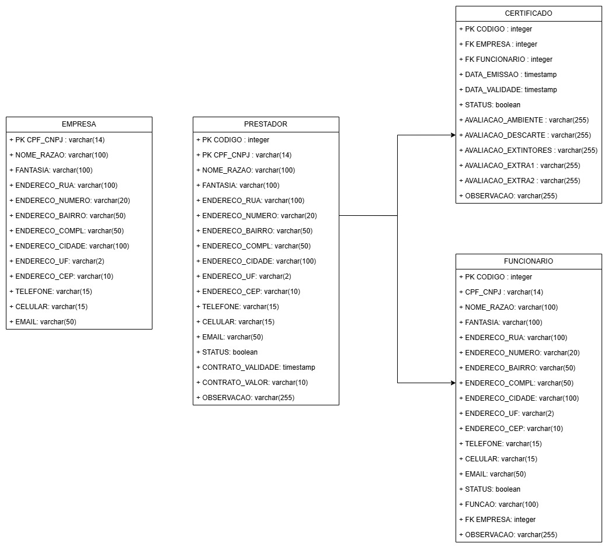

# Especificações do Projeto

Pré-requisitos: <a href="01-Documentação de Contexto.md"> Documentação de Contexto</a>

Definição do problema e ideia de solução a partir da perspectiva do usuário. 

## Usuários
<table>
<tbody>
<tr align=center>
<td width="200px"><b>Tipo de Usuário</b></td>
<td width="300px"><b>Descrição</b></td>
<td width="300px"><b>Responsabilidade</b></td>
</tr>
<tr>
<td>Especialista Segurança do Trabalho</td>
<td>Pessoa tecnicamente qualificada para exercer função de avaliações de segurança do trabalho</td>
<td>Responsável por fazer levantamento de dados e definir aptidão da empresa e/ou pessoa analisada. Visando maior segurança para o contratante.</td>
</tr>
<tr>
<td>Administrador do Sistema</td>
<td>Pessoa que mantem a estrutura de dados de forma organizada e coerente</td>
<td>Responsãvel pela inserção de dados no sistema, novos cadastros, atualizações e manutenções</td>
</tr>
</tbody>
</table>

## Arquitetura e Tecnologias

Este projeto é uma aplicação **Fullstack** composta por:

- **Backend**: .NET WebAPI  
- **Banco de Dados**: PostgreSQL  
- **Frontend**: React + TypeScript (buildado e servido pelo Nginx)  
- **Nginx**: Servidor Web + Proxy reverso para a API

## Project Model Canvas

<figure> 
  
</figure>

## Requisitos

### Requisitos Funcionais

<table>
<tbody>
<tr align=center>
<td width="100px"><b>ID</b></td>
<td width="600px"><b>Descrição do Requisito</b></td>
<td width="100px"><b>Prioridade</b></td>
</tr>
<tr>
<td>RF-01</td>
<td>Permitir o usuário cadastrar as empresas que possuem contrato</td>
<td>Alta</td>
</tr>
<tr>
<td>RF-02</td>
<td>Permitir o usuário cadastrar as pessoas que serão avaliadas para emissão de laudo</td>
<td>Alta</td>
</tr>
<tr>
<td>RF-03</td>
<td>Permitir vincular pessoa à empresa contratada</td>
<td>Média</td>
</tr>
<tr>
<td>RF-04</td>
<td>Permitir o usuário emitir os laudos técnicos para consulta posterior</td>
<td>Alta</td>
</tr>
</tbody>
</table>

### Requisitos não Funcionais

<table>
<tbody>
<tr align=center>
<td width="100px"><b>ID</b></td>
<td width="600px"><b>Descrição</b></td>
<td width="100px"><b>Prioridade</b></td>
</tr>
<tr>
<td><b>RNF-01</b></td>
<td>A aplicação deve cumprir com as normas estabelecidas pela LGPD, garantindo a privacidade e proteção dos dados pessoais dos usuários.</td>
<td>Alta</td>
</tr>
<tr>
<td><b>RNF-02</b></td>
<td>A aplicação deve ter uma interface intuitiva e de fácil uso.</td>
<td>Alta</td>
</tr>
<tr>
<td><b>RNF-03</b></td>
<td>A aplicação deve ter tempos de resposta rápidos para manter uma experiência fluida.</td>
<td>Alta</td>
</tr>
<tr>
<td><b>RNF-04</b></td>
<td>A solução deve ser desenvolvida utilizando tecnologias atuais e de fácil manutenção.</td>
<td>Média</td>
</tr>
</tbody>
</table>

## Restrições

Enumere as restrições à sua solução. Lembre-se de que as restrições geralmente limitam a solução candidata.
=======
<table>
<tbody>
<tr align=center>
<td width="100px"><b>ID</b></td>
<td width="600px"><b>Restrição</b></td>
</tr>
<tr>
<td><b>01</b></td>
<td>O projeto deverá ser entregue até o final do semestre.</td>
</tr>
<tr>
<td><b>02</b></td>
<td>Não pode ser desenvolvido um módulo apenas backend, projeto precisa de interface FrontEnd.</td>
</tr>
</tbody>
</table>

## Diagrama de Caso de Uso

O diagrama de casos de uso é o próximo passo após a elicitação de requisitos, que utiliza um modelo gráfico e uma tabela com as descrições sucintas dos casos de uso e dos atores. Ele contempla a fronteira do sistema e o detalhamento dos requisitos funcionais com a indicação dos atores, casos de uso e seus relacionamentos. 

## Modelo da Base de Dados

# Para banco de dados relacional:
* <figure> 
  Figura 1 - Tela do pgAdmin (Administrador Banco de Dados PostgreSQL)</figcaption>
</figure> 

* <figure> 
  Figura 2 - Relação entre tabelas</figcaption>
</figure>
