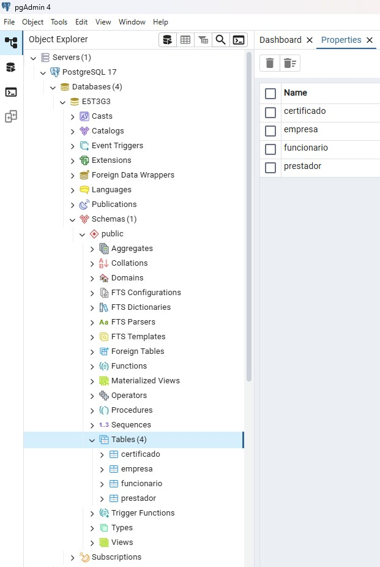
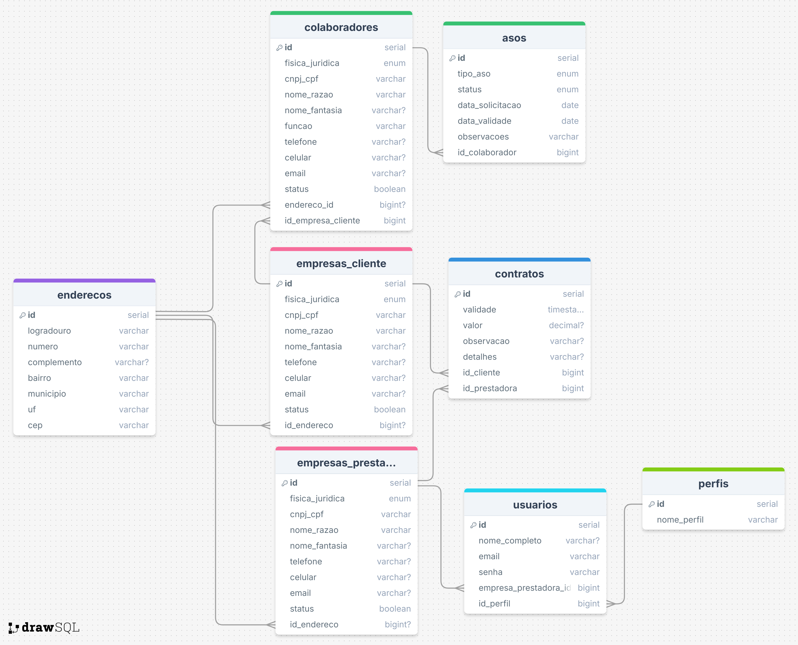

# Especificações do Projeto

A SC Prevenção enfrenta dificuldades na gestão de saúde ocupacional dos funcionários das empresas contratantes, devido à validação manual de atestados, exames periódicos e registros de aptidão. A falta de alertas sobre vencimentos e a ausência de integração com sistemas governamentais tornam o processo lento, sujeito a erros e com risco de não conformidade legal.

Para resolver esses desafios, o projeto propõe o desenvolvimento de um sistema sociotécnico integrado, capaz de centralizar o cadastro dos funcionários, automatizar a validação documental junto a órgãos governamentais e gerar alertas mensais sobre a necessidade de renovação de exames. Essa solução otimiza os processos internos da SC Prevenção, garante maior conformidade legal e facilita a gestão preventiva da saúde dos trabalhadores das empresas contratantes, ao mesmo tempo em que proporciona aos alunos a aplicação prática de conhecimentos em um contexto real.

## Usuários
| Tipo de Usuário   | Descrição | Responsabilidades |
|------------------|-----------|------------------|
| **Root** | Gerencia a aplicação e os usuários como um usuário técnico. | Gerenciar usuários, configurar o sistema, acessar funcionalidades prilivegiadas. |
| **Administrador** | Gerencia os usuários, empresas cadastradas e relatórios. | Gerenciar usuários, gerenciar empresas, acessar todos os relatórios. |
| **Colaborador** | Usa a aplicação para suas tarefas principais. | Criar e editar registros, visualizar relatórios. |

## Arquitetura e Tecnologias

O projeto será desenvolvido seguindo uma arquitetura em contêineres, utilizando o Docker Compose para orquestrar os serviços necessários. A solução será composta por dois contêineres principais:

1. Backend (.NET)

  - Responsável pela lógica de negócios, processamento de dados, integração com sistemas governamentais e gerenciamento do fluxo de validação de documentos e alertas.

  - Implementado em .NET, garantindo robustez, escalabilidade e compatibilidade com APIs externas.

2. Frontend (Next) com Nginx

  - Responsável pela interface de usuário, disponibilizando dashboards, alertas e funcionalidades de gerenciamento de funcionários de forma intuitiva.

  - O frontend será servido pelo Nginx, proporcionando alto desempenho e estabilidade na entrega das páginas.

  - Desenvolvido com Vite e TypeScript, garantindo rapidez no desenvolvimento e tipagem estática para maior confiabilidade do código.

A arquitetura em contêineres permite implantação simplificada, escalabilidade e isolamento dos serviços, enquanto o PostgreSQL em servidor externo garante segurança, persistência e facilidade de manutenção dos dados. O uso do Docker Compose assegura que backend e frontend sejam iniciados e configurados de forma automatizada, promovendo consistência entre os ambientes de desenvolvimento, teste e produção.

## Project Model Canvas

<figure> 
  
</figure>

## Requisitos

### Requisitos Funcionais

<table>
<tbody>
<tr align=center>
<td width="100px"><b>ID</b></td>
<td width="600px"><b>Descrição do Requisito</b></td>
<td width="100px"><b>Prioridade</b></td>
</tr>
<tr>
<td>RF-01</td>
<td>Permitir ao usuário cadastrar, atualizar, editar e deletar as empresas com que possue contrato</td>
<td>Alta</td>
</tr>
<tr>
<td>RF-02</td>
<td>Permitir ao usuário anexar documentos contratuais das empresas contratantes</td>
<td>Alta</td>
</tr>
<tr>
<td>RF-03</td>
<td>Permitir ao usuário listar e filtra os contratos por empresa, data de inicio e fim de contrato</td>
<td>Média</td>
</tr>
<tr>
<td>RF-04</td>
<td>Permitir ao usuário Administrador cadastrar demais colaboradores e suas predefinidas permissões para utilização do sistema</td>
<td>Média</td>
</tr>
<tr>
<td>RF-05</td>
<td>Permitir o cadastro e listagem de colaboradores pertencentes as empresas contratantes</td>
<td>Alta</td>
</tr>
<tr>
<td>RF-06</td>
<td>Permitir ao usuário deletar e atualizar os colaboradores pertencentes as empresas contratantes</td>
<td>Média</td>
</tr>
<tr>
<td>RF-07</td>
<td>Permitir filtrar os colaboradores pertencentes as empresas contratantes, pela empresa, cargo, por ASO vencido, ASO válido ou ASO vencendo </td>
<td>Média</td>
</tr>
<tr>
<td>RF-08</td>
<td>Permite ao usuário cadastrar uma ASO para um colaborador associado a uma empresa contratante</td>
<td>Alta</td>
</tr>
<tr>
<td>RF-09</td>
<td>Permite ao usuário listar as ASOs de um colaborador associado a uma empresa contratante</td>
<td>Alta</td>
</tr>
<tr>
<td>RF-10</td>
<td>Permite ao usuário atualizar as ASOs de um colaborador associado a uma empresa contratante</td>
<td>Alta</td>
</tr>
<tr>
<td>RF-11</td>
<td>Permite ao usuário deletar as ASOs de um colaborador associado a uma empresa contratante</td>
<td>Alta</td>
</tr>
<tr>
<td>RF-12</td>
<td>Permite ao usuário anexar as ASOs de um colaborador associado a uma empresa contratante</td>
<td>Alta</td>
</tr>
<tr>
<td>RF-13</td>
<td>Permite ao usuário validar a ASO de um colaborador no sistema do Gov de forma automática</td>
<td>Alta</td>
</tr>
<tr>
<td>RF-14</td>
<td>Permite ao usuário verificar o comprovante de validação da ASO de um colaborador via screenshot do processo</td>
<td>Alta</td>
</tr>
<tr>
<td>RF-15</td>
<td>Permite ao usuários efetuar o processo de Login no sistema</td>
<td>Alta</td>
</tr>
<tr>
<td>RF-16</td>
<td>Permite ao usuários efetuar o processo de Logout no sistema</td>
<td>Alta</td>
</tr>
<tr>
<td>RF-17</td>
<td>Permitir ao usuário cadastrar, atualizar, editar e deletar endereços</td>
<td>Alta</td>
</tr>
</tbody>
</table>

### Requisitos não Funcionais

<table>
<tbody>
<tr align=center>
<td width="100px"><b>ID</b></td>
<td width="600px"><b>Descrição</b></td>
<td width="100px"><b>Prioridade</b></td>
</tr>
<tr>
<td><b>RNF-01</b></td>
<td>A aplicação deve cumprir com as normas estabelecidas pela LGPD, garantindo a privacidade e proteção dos dados pessoais dos usuários.</td>
<td>Alta</td>
</tr>
<tr>
<td><b>RNF-02</b></td>
<td>A aplicação deve ter uma interface intuitiva e de fácil uso.</td>
<td>Alta</td>
</tr>
<tr>
<td><b>RNF-03</b></td>
<td>A aplicação deve ter tempos de resposta rápidos para manter uma experiência fluida.</td>
<td>Alta</td>
</tr>
<tr>
<td><b>RNF-04</b></td>
<td>A solução deve ser desenvolvida utilizando tecnologias atuais e de fácil manutenção.</td>
<td>Média</td>
</tr>
<tr>
<td><b>RNF-05</b></td>
<td>O sistema deve garantir segurança e confidencialidade dos dados, incluindo autenticação e criptografia.</td>
<td>Média</td>
</tr>
<tr>
<td><b>RNF-06</b></td>
<td>O sistema deve ser modular e bem documentado para facilitar manutenção e atualizações.</td>
<td>Média</td>
</tr>
</tbody>
</table>

## Restrições

<table>
<tbody>
<tr align=center>
<td width="100px"><b>ID</b></td>
<td width="600px"><b>Restrição</b></td>
</tr>
<tr>
<td><b>01</b></td>
<td>O projeto deverá ser entregue no final do semestre letivo, não podendo extrapolar a data de 07/12/24.</td>
</tr>
<tr>
<td><b>02</b></td>
<td>Não pode ser desenvolvido um módulo apenas backend, projeto precisa de interface FrontEnd.</td>
</tr>
<tr>
<td><b>03</b></td>
<td>A equipe não pode subcontratar o desenvolvimento do trabalho</td>
</tr>
</tbody>
</table>

## Diagrama de Caso de Uso

O diagrama de casos de uso é o próximo passo após a elicitação de requisitos, que utiliza um modelo gráfico e uma tabela com as descrições sucintas dos casos de uso e dos atores. Ele contempla a fronteira do sistema e o detalhamento dos requisitos funcionais com a indicação dos atores, casos de uso e seus relacionamentos. 

## Modelo da Base de Dados
O projeto utiliza o PostgreSQL como SGBD do projeto por ser uma solução robusta, open-source e amplamente reconhecida pela confiabilidade em ambientes de produção. Ele oferece suporte avançado a transações, integridade referencial e conformidade com o padrão SQL, garantindo segurança e consistência dos dados.

Entre suas principais vantagens destacam-se:

- Alto desempenho e escalabilidade, adequado para sistemas de pequeno a grande porte;

- Suporte a dados complexos (JSON, arrays, tipos geoespaciais, entre outros);

- Extensibilidade, permitindo criação de funções, tipos de dados e índices personalizados;

- Comunidade ativa e constante evolução, garantindo melhorias contínuas e ampla documentação.

Essas características fazem do PostgreSQL uma escolha estratégica para garantir a eficiência e a longevidade da aplicação.

# Para banco de dados relacional:
* <figure> 
  Figura 1 - Tela do pgAdmin (Administrador Banco de Dados PostgreSQL)</figcaption>
</figure> 

* <figure> 
  Figura 2 - Modelo Entidade Relacionamento MER</figcaption>
</figure>
