## Escopo (Telas e Fluxos)

1. **Login / Logout**  
   - Login, recuperação de senha, mensagens de erro (RF-15, RF-16; RNF-05).

2. **Dashboard**  
   - Indicadores de ASO vencendo, alertas, status de integrações (RF-07, RF-10; RNF-03).  
   Tela Dashboard:
   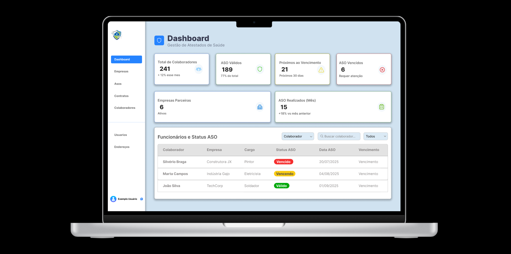
   Tela de Aviso Vencido:
   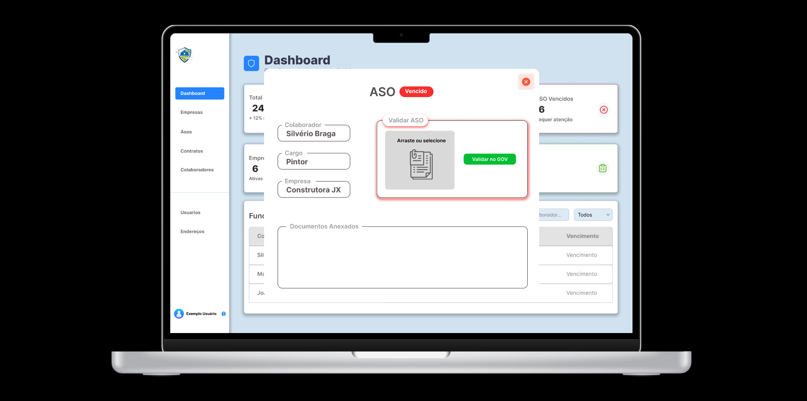
   Tela de Aviso Vencendo:
   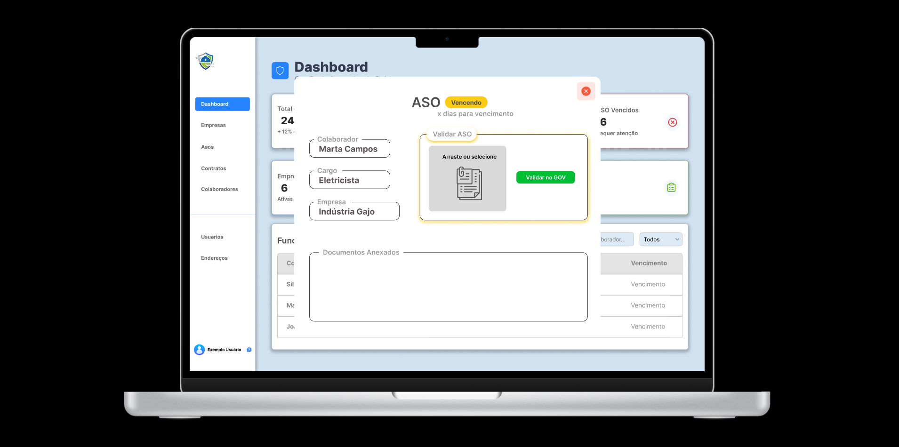
   Tela de Aviso Válido:
   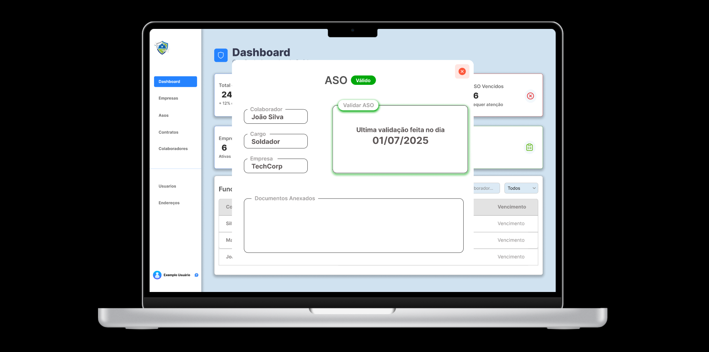

3. **Empresas & Contratos**  
   - Listar/cadastrar/editar/excluir empresas, anexar contrato, filtros por período (RF-01, RF-02, RF-03).  
   Tela Empresas:
   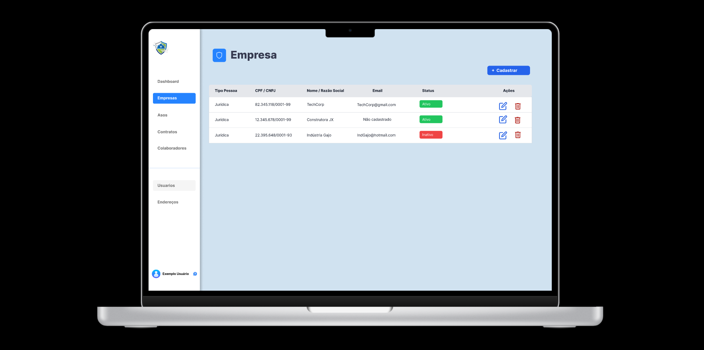
   Cadastro Empresa:
   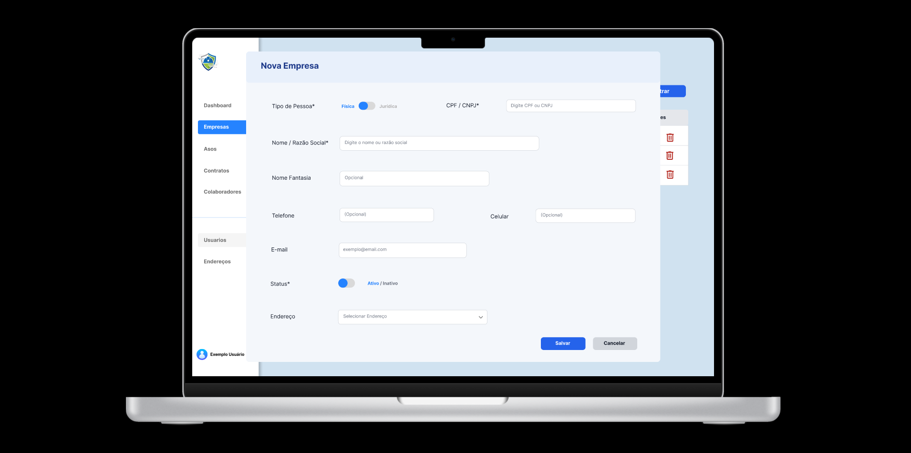
   Tela Contratos:
   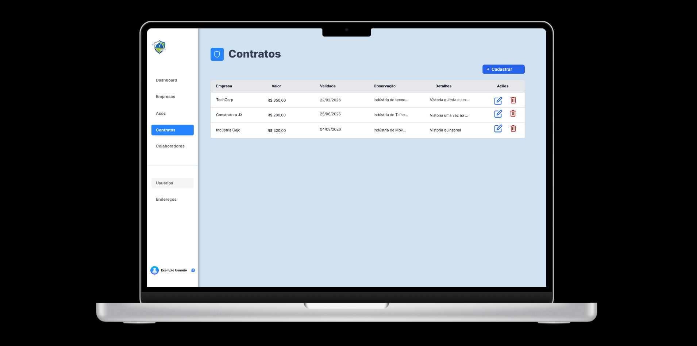
   Cadastro Contrato:
   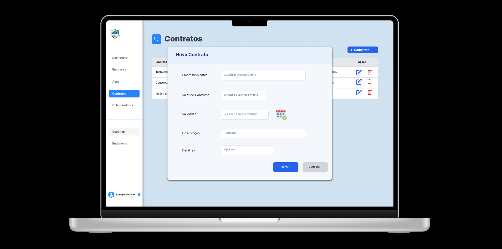

4. **Usuários do Sistema**  
   - Cadastro de usuários, perfis (Root/Administrador/Colaborador) e permissões (RF-04; RNF-01, RNF-05).  
   Tela Usuários:
   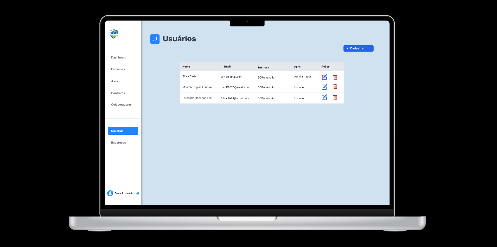
   Cadastro Usuário:
   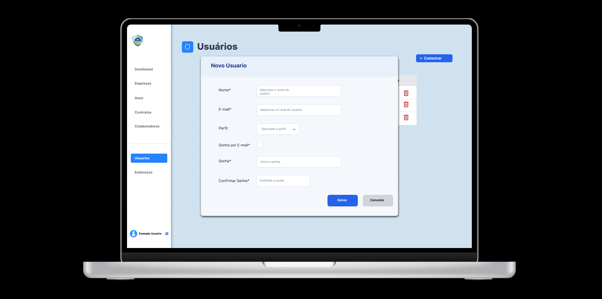
   Tela Endereço:
   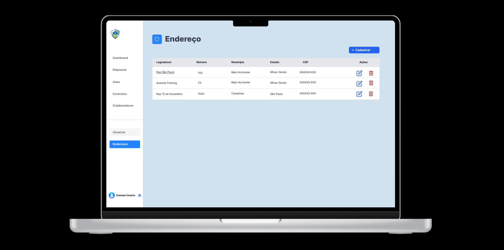
   Cadastro Endereço:
   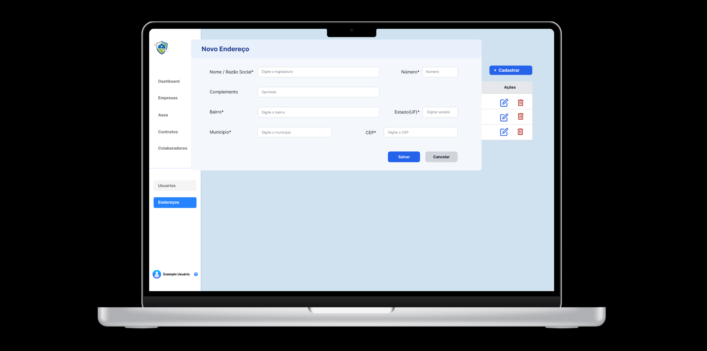

5. **Colaboradores (das empresas contratantes)**  
   - CRUD, filtros por empresa/cargo/status ASO (RF-05, RF-06, RF-07).  
   Tela Colaboradores:
   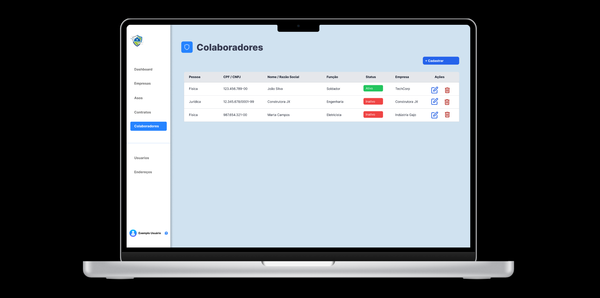
   Cadastro Colaborador:
   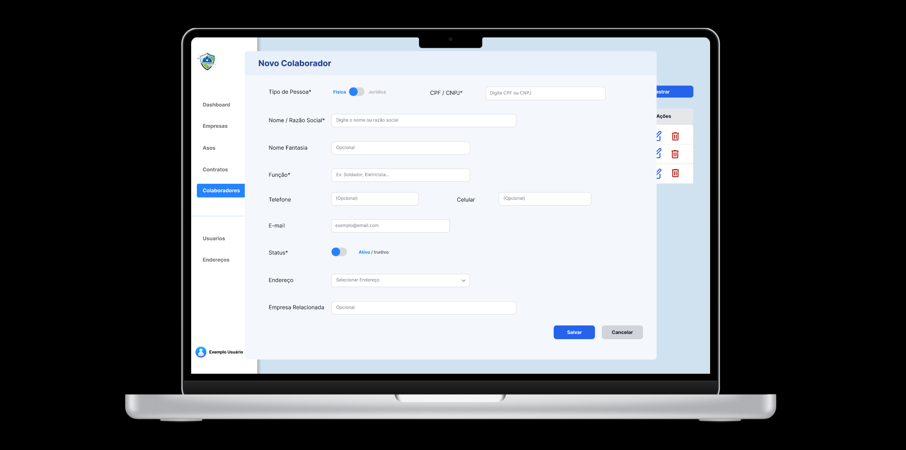

6. **ASO**  
   - CRUD, anexos, validação automática no Gov, comprovante/screenshot (RF-08 a RF-14).  
   Tela ASOS:
   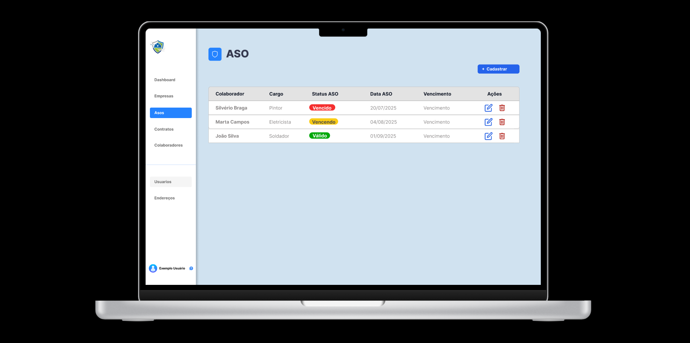
   Cadastro ASO:
   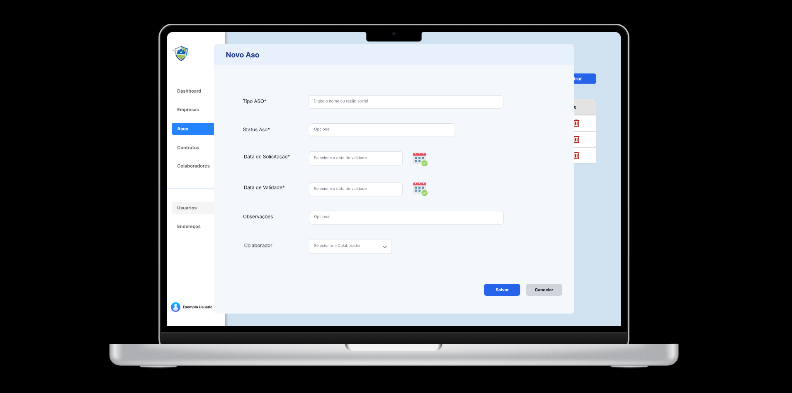

---

> **Link do Figma:** _https://www.figma.com/design/0wVpOfKNOfTbsNbIzrIKRu/Prjeto-SafeWork-Templates?node-id=0-1&p=f&t=0YowCsfgvoH7bIrU-0_  
> **Protótipo navegável:** _https://www.figma.com/proto/0wVpOfKNOfTbsNbIzrIKRu/Prjeto-SafeWork-Templates?node-id=1-2&p=f&t=mhSycJ7Qm2imccrf-0&scaling=scale-down&content-scaling=fixed&page-id=0%3A1&starting-point-node-id=1%3A2_
